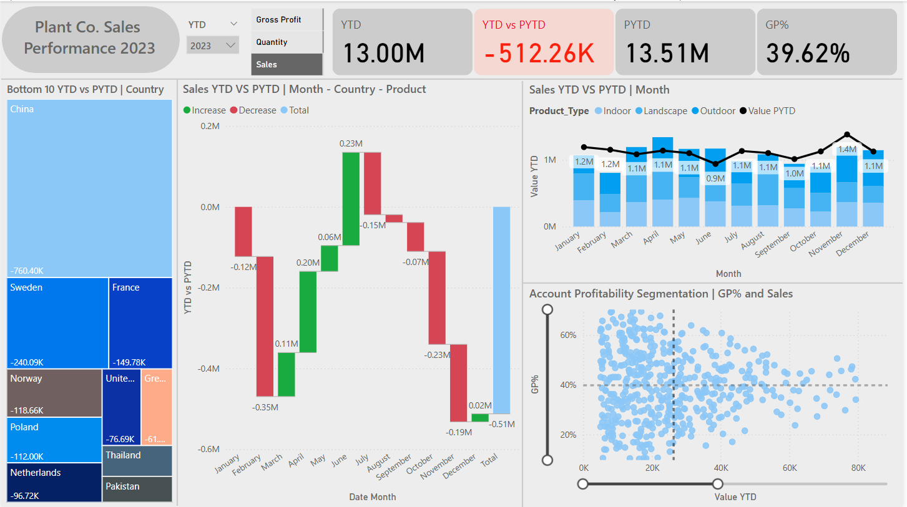

# Power BI Project: Plant Co. Performance Dashboard

## 📝 Project Overview
This project was developed as a real-world performance tracking solution for Plant Co., a company looking to gain deeper insight into its operational and sales performance across multiple regions and product lines. The primary objective was to design a comprehensive and interactive dashboard that would support business leaders in understanding both high-level trends and granular performance metrics.

The dashboard focused on Year-To-Date (YTD) and Prior Year-To-Date (PYTD) comparisons, enabling quick performance benchmarking and historical analysis. By leveraging Power BI’s data modeling and visualization capabilities, I transformed raw sales data into a dynamic reporting tool that tracks KPIs like Sales, Quantity Sold, Cost of Goods Sold (COGS), and Gross Profit (GP%).
The dashboard also includes features like drill-through analysis, dynamic titles, and metric switchers allowing users to explore data across different outlets, timeframes, and product segments. Through this project, I aimed to bridge the gap between data and decision-making, delivering a solution that is both visually intuitive and analytically powerful.

## 📸 Dashboard Preview

## 🔧 Data Preparation & Modeling
- Cleaned and renamed datasets in Power Query.
- Removed duplicate records.
- Created a calendar table and custom "Values" table for KPI filtering.
- Defined model relationships for interaction.

## 📐 DAX Measures & Logic
- **Core KPIs**: Sales, Quantity, COGS, Gross Profit, GP%
- **Time Intelligence**: YTD and PYTD calculations
- **Switch Logic**: Allows toggling between KPIs
- **Comparisons**: YTD vs PYTD
- **Dynamic Titles**: Context-aware visuals

## 📊 Dashboard Visuals
- **Tree Map**: Bottom 10 countries by YTD vs PYTD
- **Waterfall Chart**: Sales trends by month with drill-through
- **Line & Stacked Column Chart**: Trends by product type and month
- **Scatter Chart**: Profitability segmentation by GP% and sales

## 🔍 Key Insights
- Identified low-performing countries
- Visualized product trends over time
- Enabled segmentation of customer accounts

## 🛠 Tools Used
- Power BI
- Power Query
- DAX

## ✅ Outcome
Delivered a business-ready dashboard that improved visibility and insight for Plant Co., while strengthening my Power BI, DAX, and data modeling skills.

This project is part of my portfolio, showcasing the Power Bi skills essential for Data Analyst roles. If you have any questions, feedback, or would like to collaborate, feel free to get in touch!
- **LinkedIn**: [Connect with me professionally](https://www.linkedin.com/in/dhammycole/)
- **Twitter**: [Connect with me on X and let's grow together](https://x.com/Dhammy_Cole)
- **Gmail**: johndammy2022@gmail.com

Thank you for your interest in this project!
